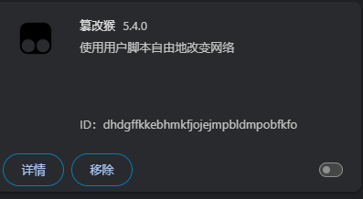
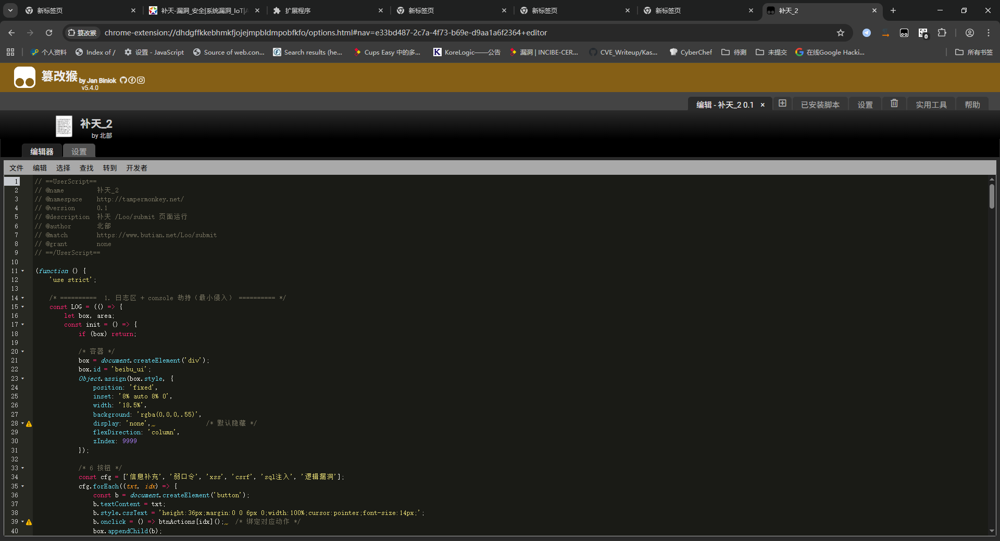
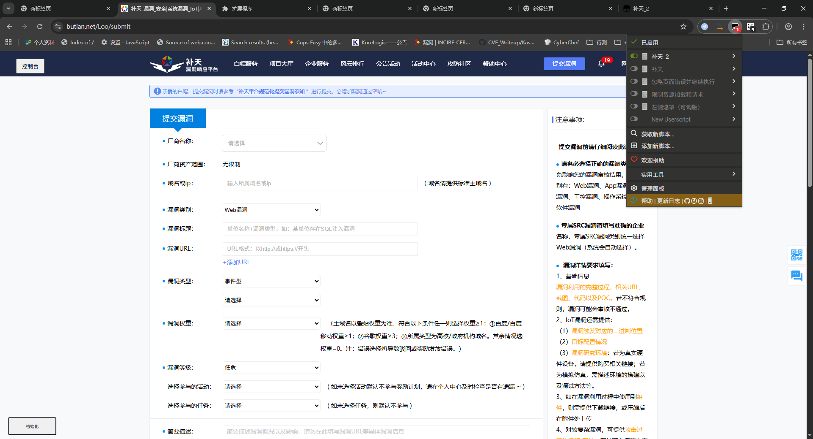
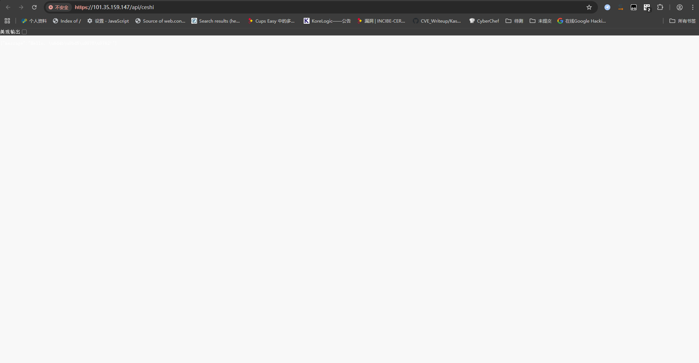
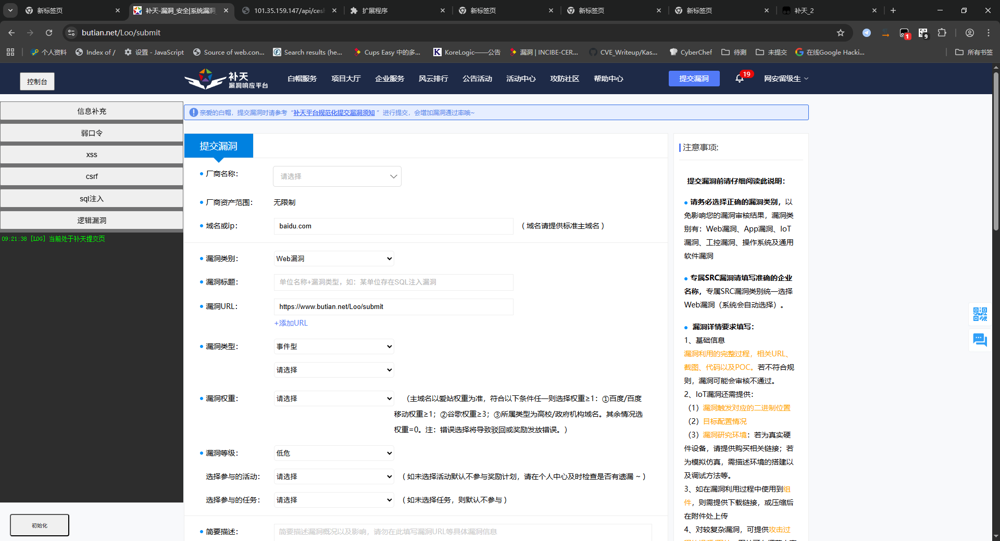
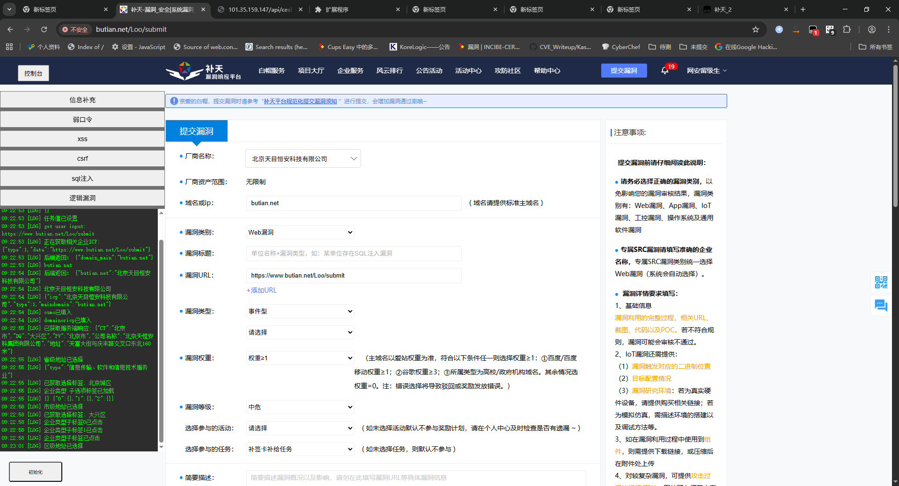
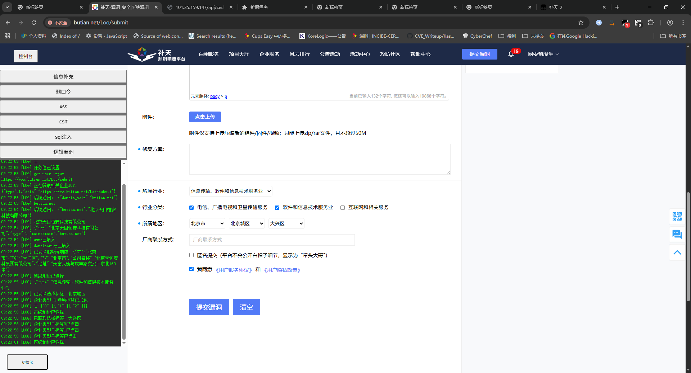
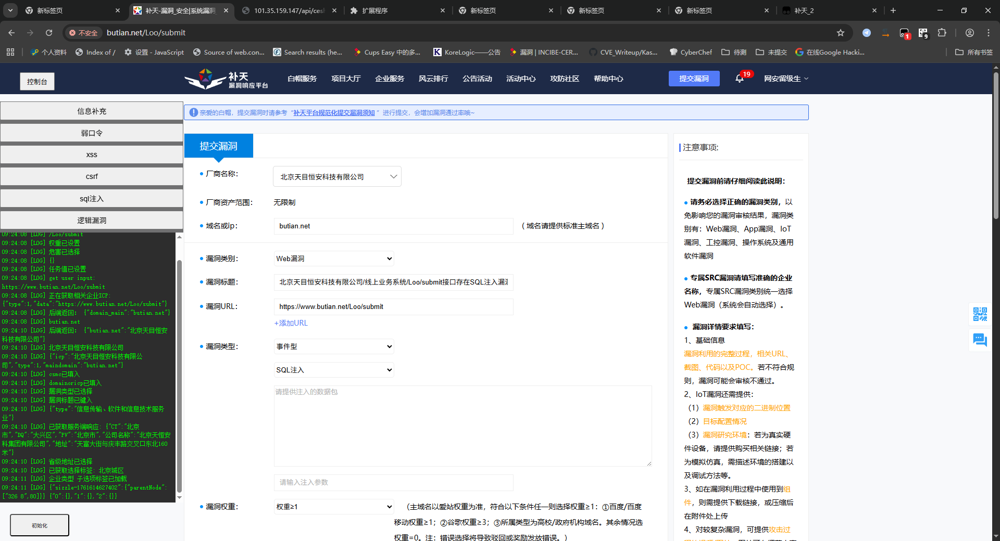

  

<h1 align="center">补天自动化提交助手</h1>

  在 <a href="https://www.butian.net/Loo/submit">补天 /Loo/submit</a> 页面一键填充漏洞表单、自动匹配企业信息、省市区地址、行业分类……把 5 分钟的手动操作压缩到 5 秒。

---

## 🚀 功能速览
| 功能 | 说明 |
|---|---|
| **一键填充** | 根据域名或url自动抓取主域、备案名、省市区、行业分类并自动回填 |
| **漏洞模板** | 弱口令、SQL 注入、XSS、CSRF、逻辑漏洞 5 套模板，点击即用 |
| **控制台日志** | 左侧增加悬浮窗实时展示运行日志，方便调试 |
| **前端** | 使用javascript动态获取并设置相关值 |
| **后端** | 相关接口为个人独立开发，排除意外因素 |
| **便利** | 用户只需填写漏洞详情，其他由脚本自动捕获生成并填充 |

## 📥 安装
<1 油猴使用
1. 安装浏览器扩展 [Tampermonkey](https://www.tampermonkey.net/)  
2. 复制粘贴 👉 monkey.js 👈 即可一键使用  
3. 打开 [补天提交页](https://www.butian.net/Loo/submit) → 右上角出现「控制台」按钮 → 开始使用！

<2浏览器扩展
1. 打开chrome://extensions/
2. 选择加载未打包的扩展程序
3. 选择butian-extension加载

## 🎬 图片演示
1.打开油猴脚本，填入并保存

2.进入补天提交页，点击初始化

3.查看弹出页面是否能正常访问，若不能，请允许不安全的证书加载

4.输入漏洞url或域名，脚本选择两者间字符最多者捕获

5.点击【信息补充】或直接选择漏洞类型并点击(需要填写漏洞url)

6.漏洞信息填充
   

